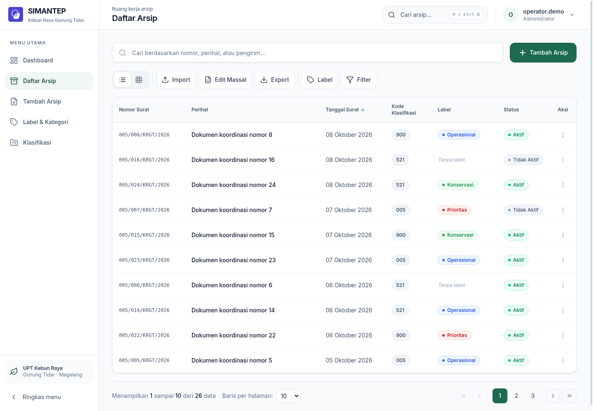
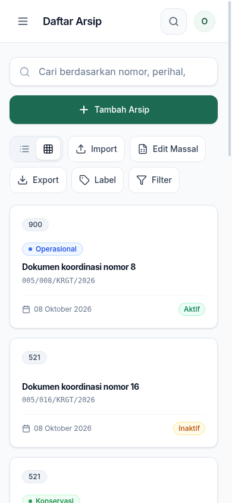

# UI/UX tahap 2: sistem visual dan layout responsif

Tahap 2 merapikan kerangka aplikasi, hierarki visual, dan penataan halaman yang
sudah ada. Aksen hijau menghubungkan ruang kerja dengan Kebun Raya Gunung Tidar;
permukaan putih dan slate menjaga dokumen tetap mudah dibaca.

## Hasil audit dan perbaikan

| Temuan | Perubahan |
| --- | --- |
| Seluruh aplikasi diperkecil melalui `body { zoom: 0.8 }` | Skala normal; ruang dan ukuran teks diatur pada komponen |
| Header memakai offset sidebar desktop pada mobile | Header sticky mengikuti lebar area konten; sidebar dan konten berbagi ukuran |
| Font eksternal dan konfigurasi tema ganda | Inter dibundel lokal; satu sumber token `@theme` Tailwind CSS 4 |
| Toolbar kehilangan label pada layar kecil | Tombol berlabel membungkus ke baris berikutnya |
| Tabel dan panel berpotensi melebarkan halaman | Tabel memiliki area gulir tersendiri; kartu mengikuti jumlah kolom responsif |
| Detail mendahulukan preview setinggi 850 px pada mobile | Informasi arsip tampil lebih dahulu; tinggi preview mengikuti viewport |
| Popover, dialog, dan toolbar pilihan kurang sesuai layar kecil | Lebar mengikuti ruang tersedia; dialog memiliki batas tinggi, gulir internal, dan portal agar tidak tertutup header |
| Menu mobile tidak mengelola fokus dan latar belakang | Fokus dibatasi di drawer, Escape menutup, fokus kembali, latar belakang inert |

Halaman yang dirapikan: dashboard, daftar tabel/kartu, form arsip, detail arsip,
label, klasifikasi, dan login. Form login mempunyai label field terhubung dan
autocomplete yang sesuai. Tombol notifikasi tanpa tindakan di header dihapus.

## Aturan desain

| Elemen | Aturan |
| --- | --- |
| Aksi utama | `primary-600` / `#1c6a52`, teks putih |
| Teks utama | `neutral-900` / `#0f172a` |
| Teks pendukung | `neutral-500` atau lebih gelap |
| Latar dan panel | `neutral-50`, putih, border `neutral-200`, bayangan ringan |
| Font | Inter 400/500/600/700; monospace sistem untuk nomor surat |
| Header | Tinggi 72 px, sticky dalam alur halaman |
| Sidebar desktop | 240 px; 80 px saat diringkas; preferensi disimpan |
| Drawer | Di bawah 1.024 px; maksimum 288 px, tetap menampilkan label penuh |
| Konten | Maksimum 1.440 px; padding 16/24/32 px mengikuti breakpoint |
| Tombol utama/navigasi | Tinggi 44–48 px |
| Field mobile | Teks minimal 16 px |
| Kartu daftar | 1 kolom mobile, 2 mulai 640 px, 3 mulai 1.280 px |
| Tabel | Minimum 1.040 px di dalam area gulir yang bisa difokuskan |

Kontras pasangan utama: putih pada `primary-600` 6,50:1; `neutral-500` pada putih
4,76:1; `neutral-500` pada `neutral-50` 4,55:1. Status tetap disampaikan lewat teks.
Warna label milik pengguna tetap mengikuti data label.

Fokus keyboard memiliki outline, navigasi menggunakan tautan dan `aria-current`,
serta tersedia tautan “Lewati ke konten”. CSS dan Framer Motion mengikuti preferensi
`prefers-reduced-motion`. Penyempurnaan semantik seluruh komponen bersama, validasi
form, dan alur impor mengikuti tahap selanjutnya; ini bukan sertifikasi WCAG seluruh aplikasi.

## Pratinjau

Gambar menggunakan data contoh terisolasi, bukan isi arsip produksi.





## Verifikasi

```sh
cd sistem-arsip
npm run check:structure
npm run lint
npm test
npm run build
```

Pemeriksaan browser menggunakan delapan halaman pada lebar 320, 390, 768, 1.024,
1.280, dan 1.440 px. Pemeriksaan meliputi overflow halaman, batas header/konten,
pemuatan font, ukuran teks input, dan visibilitas navigasi. Interaksi tambahan
memeriksa drawer dan keyboard, persistensi sidebar, command search, menu akun,
popover label, dialog label/klasifikasi, toolbar pilihan, dan jumlah kolom kartu.

Hasil lokal: 48 skenario layout dan 16 pemeriksaan interaksi lulus. Empat pemeriksaan
tambahan pada 320 × 568 px meliputi teks panjang dan subklasifikasi, form label yang
diperluas tanpa gulir horizontal, tombol tutup di atas header, serta gulir form
klasifikasi. Lint, pemeriksaan struktur, 19 tes Node, dan build produksi lulus.

Regresi tahap 1 memeriksa query, filter, pagination, detail ID, refresh/kembali,
error/retry, command palette, dan pembaruan realtime dengan fixture. Pemeriksaan
ini tidak melakukan mutation pada Supabase produksi dan tidak menguji RLS.
Sebanyak 34 pemeriksaan regresi browser tahap 1 lulus. Build masih melaporkan
peringatan ukuran chunk besar dan data Browserslist lama yang sudah ada sebelumnya.

Smoke test pada deployment:

1. Gunakan desktop dan mobile; periksa delapan halaman utama.
2. Buka/tutup drawer dengan Tab, Shift+Tab, dan Escape; periksa fokus kembali.
3. Ringkas sidebar desktop, refresh, lalu buka menu pada mobile.
4. Geser tabel di dalam panel atau pilih tampilan kartu; gabungkan filter.
5. Buka form/detail dan dialog pada layar pendek; periksa field serta tombol tetap terjangkau.

## Referensi

- [Document Management Dashboard UI — Dribbble](https://dribbble.com/shots/26057642-Document-Management-Dashboard-UI): inspirasi hierarki dashboard dan panel dokumen.
- [WCAG 2.2: Reflow](https://www.w3.org/WAI/WCAG22/Understanding/reflow.html): konten pada lebar 320 CSS px dan area tabel yang menggulir secara terpisah.
- [WCAG 2.2: Target Size (Minimum)](https://www.w3.org/WAI/WCAG22/Understanding/target-size-minimum.html): pertimbangan ukuran kontrol.
- [Tailwind CSS 4: Using a JavaScript config file](https://tailwindcss.com/docs/upgrade-guide#using-a-javascript-config-file): konfigurasi JavaScript tidak terdeteksi otomatis.
